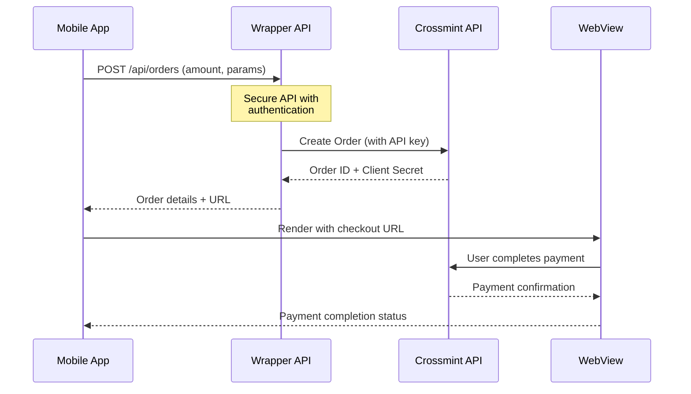

# Kontigo App - Crossmint Integration

## Architecture



## Repository Structure

This repository is organized as a monorepo with two main applications:

```bash
/apps
  /mobile - Expo-based React Native mobile app
  /web    - Next.js API wrapper service
```

## Technical Stack

### Mobile Application (apps/mobile)

- **Framework**: React Native with Expo
- **State Management**: React Query for API data fetching

### Wrapper API (apps/api)

- **Framework**: Next.js App Router
- **API Structure**: Route-based API endpoints
- **Endpoints**:
  - `POST /api/orders`: Creates orders with Crossmint
- **Security Features**:
  - Server-side API key validation
  - Environment detection (production/staging)

## Payment Flow Details

1. User enters payment amount in mobile app
2. Mobile app calls wrapper API endpoint:

   ```bash
   POST /api/orders
   ```

3. Wrapper API authenticates with Crossmint using server API key
4. Wrapper API creates order and returns:
   - `clientSecret`
   - `orderId`
   - Environment info (production/staging)
5. Mobile app generates a checkout URL with:
   - Order information
   - UI customization
   - Locale settings
6. Mobile app renders a WebView with the checkout URL
7. User completes payment in the WebView interface

## Security Architecture

- API keys (`sk_production_*` or `sk_staging_*`) are stored only in the wrapper API's environment variables
- Wrapper API validates the key format and environment
- No sensitive credentials are exposed to the mobile app
- WebView isolates payment processing from native code
- Custom user agent ensures proper rendering in WebView

## Integration Guide

1. **Setup Wrapper API**:
   - Clone this repository
   - Configure environment variables in `.env.local`

   ```bash
   CROSSMINT_API_KEY=sk_staging_xxxxxxxx
   ```

   - Deploy API to secure environment (e.g. Vercel) or use ngrok for local development

2. **Configure Mobile App**:
   - Update `.env` with `EXPO_PUBLIC_API_URL` that points to your wrapper API
   - Customize appearance settings in `src/utils/checkout.ts`

3. **Testing Flow**:
   - Use staging environment for development
   - Switch to production for live payments

## Important Security Considerations

- **NEVER** include Crossmint API keys in the mobile app
- **ALWAYS** implement proper authentication in the wrapper API
- Validate all inputs before forwarding to Crossmint
- Implement proper error handling and logging

## Development Setup

```bash
# Install dependencies
pnpm install

# Run API
pnpm web:dev

# Run mobile app
pnpm mobile:dev
```

## Production Deployment

- Deploy the wrapper API to a secure environment with proper SSL certificates
- Configure environment variables for production
- Build and publish the mobile app through your app store processes
